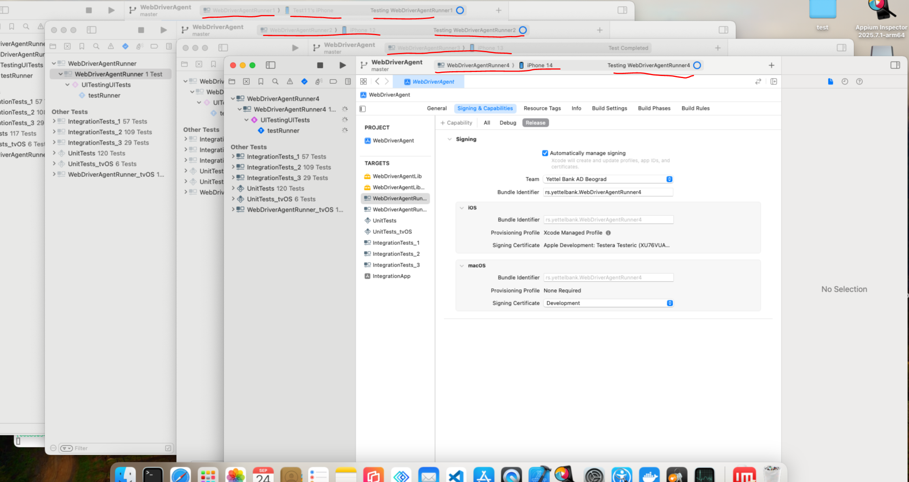

# --------------------------------------------------

# 🔹 Commands (mobile-grid.sh) chmod +x mobile-grid-not-log.sh

# --------------------------------------------------

# ✅ Start everything

./mobile-grid.sh start

# ⛔ Stop everything

./mobile-grid.sh stop

# 🔄 Restart everything

./mobile-grid.sh restart all

# 📋 List running processes

./mobile-grid.sh list

# --------------------------------------------------

# 🔹 Restart individual components

# --------------------------------------------------

# Restart only a specific Node (example: node1.toml)

./mobile-grid.sh restart node1

# Restart only a specific Appium server (example: appium2.yml)

./mobile-grid.sh restart appium2

# Restart all WDA + iproxy processes

./mobile-grid.sh restart wda

# Restart everything in one line

./mobile-grid.sh stop && ./mobile-grid.sh start

# --------------------------------------------------

# 🔹 Logs

# --------------------------------------------------

# Logs are stored in /tmp/

tail -f $(ls -t /tmp/appium*appium1.yml*\*.log | head -n 1)

# Clean up old logs (older than 2 days)

find /tmp -name "appium*\*.log" -mtime +2 -delete
find /tmp -name "node*\_.log" -mtime +2 -delete
find /tmp -name "selenium-hub\_\_.log" -mtime +2 -delete
find /tmp -name "wda*\*.log" -mtime +2 -delete
find /tmp -name "iproxy*\*.log" -mtime +2 -delete

1. After restaring we need to clear all issue in XCode
2. Product/Test
3. Ready for testing
   
